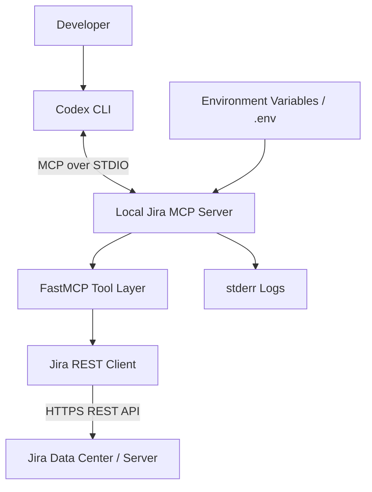
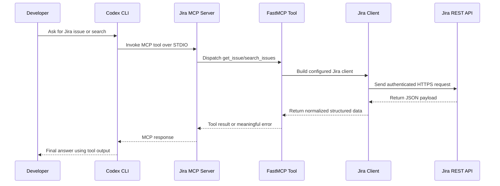
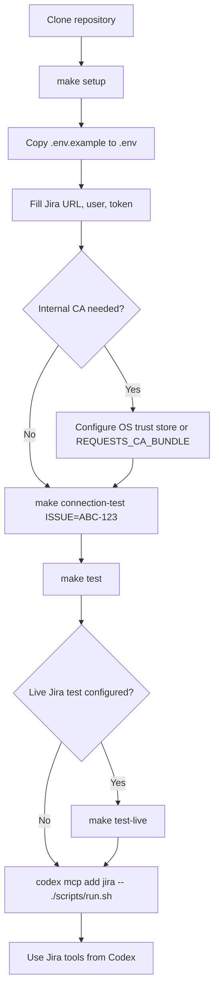

# Jira MCP Starter

## Table of Contents

- [Overview](#overview)
- [Quick Start](#quick-start)
- [How It Works](#how-it-works)
- [Architecture](#architecture)
- [Setup and Configuration](#setup-and-configuration)
- [Running and Testing](#running-and-testing)
- [Codex Integration](#codex-integration)
- [Development](#development)
- [Troubleshooting](#troubleshooting)
- [Checklist](#checklist)

## Overview

This project provides a production-quality local MCP server for Jira Data Center / Server. It runs over STDIO using the official Python MCP SDK (`FastMCP`), connects to Jira through the REST API with `requests`, and is designed to be registered with Codex CLI via `codex mcp add`.

The server exposes two MCP tools:

- `get_issue(key: str)` for a concise structured Jira issue view including the last 5 comments and linked issues
- `search_issues(jql: str, max_results: int)` for JQL-based issue search

This starter is aimed at developers who need an on-prem Jira integration that is easy to understand, easy to run locally, and safe to hand to another engineer. The MCP server is not a hosted service and it does not maintain its own database, queue, or cache. Instead, Codex starts the server as a local process and calls its tools on demand. Each tool invocation makes a live Jira REST request, shapes the response into a compact structure, and returns that result to Codex.

STDIO matters here because MCP expects the server to exchange protocol messages over standard input and output. That keeps the local integration simple: no port allocation, no reverse proxy, no inbound firewall openings, and no separate HTTP service lifecycle to manage. To avoid breaking the MCP protocol stream, logs are written to `stderr` instead of `stdout`.

## Quick Start

If you want the shortest path from clone to a working local integration:

```bash
make setup
cp .env.example .env
# fill in JIRA_BASE_URL, JIRA_USER, JIRA_TOKEN
make connection-test ISSUE=ABC-123
make lint
make typecheck
make test
make run
```

After the local checks pass, register the server with Codex:

```bash
codex mcp add jira -- ./scripts/run.sh
```

## How It Works

At runtime, the control flow is straightforward:

1. A developer asks Codex to fetch or search Jira data.
2. Codex invokes one of the registered MCP tools on the local server process.
3. The FastMCP tool handler loads configuration from the environment and creates a Jira client.
4. The Jira client performs an authenticated REST call against the Jira Server / Data Center instance.
5. The raw Jira JSON is reduced to a concise, structured response that is easier for Codex to use.
6. Codex receives the tool result and uses it in its answer to the developer.

The server is intentionally request-driven. There is no polling loop, no background refresh, and no cache invalidation logic because nothing is cached in the first place. If Jira changes between two tool calls, the second tool call sees the newer Jira state.

## Architecture

The system is small enough that the main design goal is clarity. The diagram below shows the process boundaries and the responsibilities of each layer.



### Architecture Notes

- Codex only sees the MCP tool interface, not Jira directly.
- The local server process is the trust boundary for credentials because it reads `JIRA_USER`, `JIRA_TOKEN`, and TLS configuration.
- The Jira client owns HTTP concerns such as authentication, timeouts, retries, TLS verification, and response parsing.
- The FastMCP layer owns the tool interface and converts client exceptions into MCP-safe runtime errors.
- Logging is intentionally separated to `stderr` so MCP responses on `stdout` remain protocol-clean.

## Setup and Configuration

### Repository Layout

```text
jira-mcp-starter/
├── .env.example
├── .gitignore
├── README.md
├── pyproject.toml
├── jira_mcp/
│   ├── __init__.py
│   ├── jira_client.py
│   ├── server.py
│   └── utils.py
└── scripts/
    ├── run.sh
    ├── setup.sh
    └── test_jira_connection.py
```

### Prerequisites

- Python 3.10 or newer
- Access to a Jira Data Center or Jira Server instance
- A Jira username and API token, PAT, or password that your instance accepts for REST authentication
- Shell access to run the setup and launch scripts

### Setup

1. Clone or copy this repository locally.
2. Enter the project directory:

   ```bash
   cd jira-mcp-starter
   ```

3. Run the setup script:

   ```bash
   ./scripts/setup.sh
   ```

   Or use the Makefile convenience target:

   ```bash
   make setup
   ```

4. Copy the environment template:

   ```bash
   cp .env.example .env
   ```

5. Edit `.env` with your Jira settings.
6. Run the local quality and test checks:

   ```bash
   make lint
   make typecheck
   make test
   ```

### Using Make

The repository includes an optional `Makefile` as a convenience layer over the existing scripts. It does not replace the scripts or Python tooling; it simply gives you shorter, stable commands for common workflows.

Python dependencies and development tooling are declared in `pyproject.toml`, so the repository has a single dependency source of truth and is ready for normal package-style installation in local environments and CI.

Common commands:

```bash
make
make setup
make test
make run
make test-live
make test-mcp-live
make lint
make typecheck
make connection-test ISSUE=ABC-123
make clean
```

`make` by itself prints the available targets.

Quality commands:

- `make lint` runs Ruff to catch import issues, style drift, and a set of common bug-prone patterns.
- `make typecheck` runs mypy to validate that the annotated Python interfaces still match how the code is actually used.

### Environment Variables

The server reads configuration from environment variables or a local `.env` file in the project root.

Configuration is loaded at request time. That makes local iteration simple: after editing `.env`, restart the server and new requests will use the updated values. Shell-provided environment variables take precedence because the `.env` loader only fills in values that are not already present in the process environment.

- `JIRA_BASE_URL`
  Base URL for your Jira instance, for example `https://jira.example.com`
- `JIRA_USER`
  Jira username or service account name
- `JIRA_TOKEN`
  Jira PAT, API token, or password accepted by your Jira deployment
- `JIRA_VERIFY_TLS`
  Optional. Defaults to `true`. Set to `false` only when you must connect to a Jira instance using a self-signed or otherwise untrusted certificate
- `JIRA_TIMEOUT_SECONDS`
  Optional. Defaults to `15`. Controls the per-request Jira HTTP timeout in seconds
- `JIRA_MAX_RETRIES`
  Optional. Defaults to `2`. Controls how many additional retry attempts are made for retryable failures
- `REQUESTS_CA_BUNDLE`
  Optional. Path to a PEM CA bundle file for this project. Use this when you want Python `requests` to trust your internal CA without disabling TLS verification for Jira requests

Recommended defaults:

- keep `JIRA_VERIFY_TLS=true` in normal development and production-like usage
- keep `JIRA_TIMEOUT_SECONDS=15` unless your Jira environment is consistently slower or faster than that default
- keep `JIRA_MAX_RETRIES=2` unless you specifically want faster failure or more tolerance for transient internal network issues
- use `REQUESTS_CA_BUNDLE` if Jira is signed by an internal CA
- set `JIRA_VERIFY_TLS=false` only as a short-lived debugging fallback when proper CA trust is not yet configured

Example `.env`:

```dotenv
JIRA_BASE_URL=https://jira.example.com
JIRA_USER=svc_codex
JIRA_TOKEN=replace-me
JIRA_VERIFY_TLS=true
JIRA_TIMEOUT_SECONDS=15
JIRA_MAX_RETRIES=2
# REQUESTS_CA_BUNDLE=/absolute/path/to/corporate-root-ca.pem
JIRA_TEST_ISSUE_KEY=ABC-123
JIRA_TEST_JQL=project = ABC ORDER BY updated DESC
```

Optional test-only variables:

- `JIRA_TEST_ISSUE_KEY`
  A real Jira issue key used by the live integration test
- `JIRA_TEST_JQL`
  Optional JQL for the live search test. Defaults to `project = ABC ORDER BY updated DESC` in the example template and falls back to `issuekey = <JIRA_TEST_ISSUE_KEY>` if omitted

### Trust an Internal CA Certificate

If your Jira Data Center or Jira Server instance uses a certificate chain signed by an internal or self-managed CA, prefer adding that CA certificate to the operating system trust store or setting `REQUESTS_CA_BUNDLE`. Avoid setting `JIRA_VERIFY_TLS=false` unless you are doing short-lived local debugging.

#### Windows

For a machine-wide trust configuration:

1. Export the root CA certificate from your internal PKI as a public `.cer` file.
2. Open the local machine certificate manager with `certlm.msc` or use `mmc` with the Certificates snap-in for the local computer.
3. Import the certificate into `Trusted Root Certification Authorities`.

Command-line alternative:

```powershell
certutil -addstore root C:\path\to\corporate-root.cer
```

After import, start a new shell before rerunning the connection test.

#### macOS

Using Keychain Access:

1. Open `Keychain Access`.
2. Select the `System` keychain.
3. Drag the CA certificate into Keychain Access.
4. Open the certificate, expand `Trust`, and set the relevant SSL trust policy if your environment requires an explicit override.

Restart the terminal session after import so tools pick up the updated trust settings.

#### Linux

Linux trust-store commands vary by distribution.

For Debian or Ubuntu:

```bash
sudo cp corporate-root-ca.crt /usr/local/share/ca-certificates/
sudo update-ca-certificates
```

For RHEL, Rocky, AlmaLinux, CentOS Stream, or Fedora:

```bash
sudo cp corporate-root-ca.crt /etc/pki/ca-trust/source/anchors/
sudo update-ca-trust extract
```

If browser-based testing still fails after installing the CA, restart the browser. On Ubuntu, snap-packaged applications may not automatically pick up certificates added to the host trust store.

#### Project-Local Alternative

If you do not want to change the operating system trust store, point Python `requests` at a CA bundle file:

```dotenv
REQUESTS_CA_BUNDLE=/absolute/path/to/corporate-root-ca.pem
```

This keeps `JIRA_VERIFY_TLS=true` while allowing this project to trust your internal CA.

## Running and Testing

### Test Jira Connectivity

After `.env` is configured, validate connectivity by fetching a known issue:

```bash
./scripts/test_jira_connection.py ABC-123
```

Or:

```bash
make connection-test ISSUE=ABC-123
```

This script automatically re-execs under `.venv/bin/python` when the virtual environment exists, loads `.env`, calls Jira, and prints the returned issue JSON if the request succeeds.

### Run the MCP Server

Start the local STDIO server with:

```bash
./scripts/run.sh
```

Or:

```bash
make run
```

The server stays idle until Codex calls one of its tools. It does not fetch Jira data proactively. When a tool is invoked, the server performs a live Jira request, returns the result, and waits for the next MCP message. This makes behavior predictable for debugging because each Jira read maps directly to a visible user request in Codex.

The server logs to `stderr` so MCP protocol messages on `stdout` remain clean. If you ever print arbitrary output to `stdout` from the server code, you risk corrupting the MCP transport.

### Request Lifecycle

The following sequence shows what happens during a typical `get_issue` or `search_issues` call.



#### Runtime Behavior

- `get_issue` calls Jira issue lookup and returns one structured issue view.
- `search_issues` calls Jira search and returns a bounded list of issue summaries.
- Missing fields are tolerated and normalized into `None` or empty lists where appropriate.
- Transient network or server-side failures are retried with a small backoff.
- Authentication failures, invalid issue keys, and invalid JQL are surfaced as clear tool errors rather than hidden retries.

### Run Automated Tests

Run the complete local test suite with:

```bash
./scripts/run_tests.sh
```

Or:

```bash
make test
```

This runs:

- mocked unit tests that do not require Jira access
- mocked server tool tests that validate the MCP-facing output shape
- optional live integration tests that run only when `JIRA_TEST_ISSUE_KEY` is set in `.env` or your shell

Before opening a pull request or pushing a larger change, also run:

```bash
make lint
make typecheck
```

To run only unit tests:

```bash
python -m unittest discover -s tests -p 'test_*.py' -v
```

To run only the live Jira validation tests after configuration:

```bash
python -m unittest tests.test_live_jira -v
```

Or:

```bash
make test-live
```

To run a live end-to-end MCP transport test without Codex, use:

```bash
make test-mcp-live
```

This test launches the local MCP server over stdio, initializes an MCP client session, lists tools, and calls `get_issue` and `search_issues` through the MCP protocol itself. It validates the actual server transport path rather than talking to Jira through the Python client directly.

### Validation and Rollout Flow

Use the following sequence when bringing up the project on a new machine or handing it to another developer.



This flow intentionally separates local confidence checks:

- `make connection-test ISSUE=ABC-123` proves credentials, TLS trust, and basic issue access.
- `make test` proves the mock-based behavior and output shaping without depending on Jira availability.
- `make test-live` proves that the real Jira integration matches the expected response shape for your environment.
- `make test-mcp-live` proves that the stdio MCP transport, server initialization, and live Jira-backed MCP tool execution all work without needing Codex in the loop.

## Codex Integration

### Connect to Codex

From the repository root, register the MCP server with Codex using:

```bash
codex mcp add jira \
  --env JIRA_BASE_URL=https://jira.example.com \
  --env JIRA_USER=your.username \
  --env JIRA_TOKEN=your-token \
  --env JIRA_VERIFY_TLS=true \
  -- python jira_mcp/server.py
```

If you prefer to rely on the local `.env` file instead of passing values inline, use:

```bash
codex mcp add jira -- ./scripts/run.sh
```

Use the inline `--env` version when you want an explicit, self-contained Codex registration command, such as in a throwaway environment or when documenting exact values to pass through a launcher. Use the `./scripts/run.sh` version when you want the repo itself to remain the source of truth for local developer setup.

In both cases, Codex launches the server locally and talks to it over STDIO. There is no separate deployment target, listener port, or remote MCP endpoint in this starter.

### Example Codex Prompts

- `Fetch Jira issue ABC-123 and summarize it`
- `Search Jira for open bugs in project ABC`

## Development

### Implementation Notes

#### Transport and Process Model

- The MCP server runs locally over STDIO using FastMCP.
- Tool calls are synchronous and request-driven.
- There is no in-process cache, database, scheduler, or background sync worker.

#### Authentication and TLS

- Jira credentials are read from environment variables, never hardcoded.
- `requests` uses HTTP basic auth with the configured Jira user and token or password.
- TLS verification is enabled by default and can be customized with `REQUESTS_CA_BUNDLE`.

#### Resilience

- Jira requests use explicit timeouts to avoid hanging the MCP server indefinitely.
- Basic retry logic handles transient network and server-side failures.
- Non-retryable cases such as authentication failures, invalid requests, and missing issues fail fast with clearer errors.
- Timeout and retry defaults live in the Jira client configuration, which makes them straightforward to tune for slower on-prem Jira environments.

#### Data Shaping

- The server reduces Jira’s larger REST payloads into concise structures that are easier for Codex to reason about.
- `get_issue` emphasizes the fields most useful during investigation: summary, description, people, labels, versions, comments, and issue links.
- `search_issues` returns compact summaries suitable for triage and follow-up prompts.

#### Logging

- Logs go to `stderr`, not `stdout`.
- This is required to avoid corrupting MCP protocol output.

## Troubleshooting

- Authentication failures:
  Verify `JIRA_USER` and `JIRA_TOKEN`, and confirm that your Jira instance accepts those credentials for REST API access.
- TLS failures:
  If your Jira server uses a self-signed or privately signed certificate, prefer installing the CA or setting `REQUESTS_CA_BUNDLE`. Use `JIRA_VERIFY_TLS=false` only as a temporary fallback.
- 404 issue errors:
  Confirm the issue key exists and the configured Jira account has permission to read it. A valid-looking key can still return 404 if the account lacks browse access.
- Invalid JQL or 400 errors:
  Re-run the query in Jira directly to confirm the syntax and field names supported by your Jira instance.
- Empty search results:
  Verify the JQL is valid and that the Jira account can see matching issues.
- Unexpected live behavior:
  Remember that the server does not poll or cache. If Jira changed, rerun the prompt or the tool call to fetch the latest data.
- Lint or type-check failures:
  Run `make lint` and `make typecheck`. Ruff failures usually point to style or correctness issues, while mypy failures usually mean the declared types and actual runtime behavior have drifted apart.

### Continuous Integration

The repository includes a GitHub Actions workflow at `.github/workflows/ci.yml`.

On pushes to `main` and on pull requests, CI runs on:

- Ubuntu
- macOS
- Windows

For each operating system, the workflow:

- installs the project and development dependencies from `pyproject.toml`
- runs Ruff lint checks
- runs mypy type checks
- runs the unittest suite

The workflow intentionally calls Python tooling directly instead of relying on `make`, so the hosted CI path stays portable across platforms while the local developer workflow can still use the Makefile shortcuts.

## Checklist

- Fill in `.env` with `JIRA_BASE_URL`, `JIRA_USER`, and `JIRA_TOKEN`
- Set `JIRA_TEST_ISSUE_KEY` to a real issue for live validation
- Run `./scripts/setup.sh`
- Run `make lint`
- Run `make typecheck`
- Test with `./scripts/test_jira_connection.py ABC-123`
- Run `./scripts/run_tests.sh`
- Connect Codex with `codex mcp add jira ... -- python jira_mcp/server.py`
